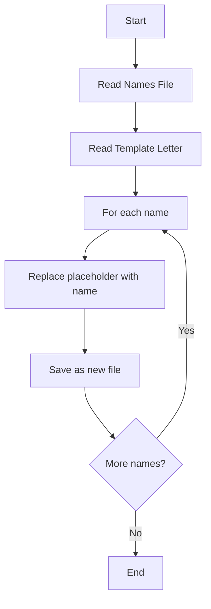

# 🐍 Python Mail Merger - Day 24

[](https://www.python.org/downloads/)
[](https://opensource.org/licenses/MIT)
[](http://makeapullrequest.com)
[](https://github.com/krishpatel-dev/Day24_mail_merging/graphs/commit-activity)

Welcome to Day 24 of the Python learning journey! 🚀 This project is an automated mail merging tool that generates personalized invitation letters by replacing placeholders with names from a list.

## 📋 Table of Contents
- [Project Overview](#-project-overview)
- [Features](#-features)
- [Getting Started](#-getting-started)
  - [Prerequisites](#prerequisites)
  - [Installation](#installation)
  - [Usage](#usage)
- [Project Structure](#-project-structure)
- [Customization](#-customization)
- [Project Architecture](#-project-architecture)
- [Contributing](#-contributing)

## 🌟 Project Overview

This Python script automates the process of creating personalized invitation letters. It reads a list of names from a file and generates individual invitation letters by inserting each name into a template letter.

## ✨ Features

- **Automated Mail Merging**: Generate multiple personalized letters with a single script execution
- **Template-Based**: Uses a customizable template for the invitation letters
- **Easy to Use**: Simple command-line interface with no external dependencies
- **Organized Output**: Automatically saves generated letters in a structured directory

## 🛠 Getting Started

### Prerequisites
- Python 3.8 or higher
- Basic understanding of file operations in Python

### Installation

1. **Clone the repository**
   ```bash
   git clone https://github.com/krishpatel-dev/Day24_mail_merging.git
   cd Day24_mail_merging
   ```

2. **Set up a virtual environment (recommended)**
   ```bash
   python -m venv venv
   source venv/bin/activate  # On Windows: venv\Scripts\activate
   ```

### Usage

1. Prepare your input files:
   - Add recipient names to [Input/Names/invited_names.txt](cci:7://file:///e:/Complete%20Python%20Course/Day%2024/Input/Names/invited_names.txt:0:0-0:0) (one name per line)
   - Customize the invitation template in [Input/Letters/starting_letter.txt](cci:7://file:///e:/Complete%20Python%20Course/Day%2024/Input/Letters/starting_letter.txt:0:0-0:0)

2. Run the script:
   ```bash
   python Proj24_mail_merging.py
   ```

3. Find your generated letters in the `Output/ReadyToSend/` directory

## 📁 Project Structure

```
Day24_mail_merging/
├── Input/
│   ├── Letters/
│   │   └── starting_letter.txt  # Template for the invitation
│   └── Names/
│       └── invited_names.txt    # List of recipient names
├── Output/
│   └── ReadyToSend/             # Generated letters will be saved here
│       ├── letter_for_Name1.txt
│       ├── letter_for_Name2.txt
│       └── ...
├── Proj24_mail_merging.py       # Main script
└── README.md                    # This file
```

## 🎨 Customization

### Customizing the Invitation
Edit [Input/Letters/starting_letter.txt](cci:7://file:///e:/Complete%20Python%20Course/Day%2024/Input/Letters/starting_letter.txt:0:0-0:0) to change the invitation text. Use `[name]` as a placeholder that will be replaced with actual names.

### Adding More Recipients
Simply add more names to [Input/Names/invited_names.txt](cci:7://file:///e:/Complete%20Python%20Course/Day%2024/Input/Names/invited_names.txt:0:0-0:0), one name per line.

### Output Location
By default, letters are saved in the `Output/ReadyToSend/` directory. You can modify the output path in the script if needed.

## 🏗️ Project Architecture



### Key Components
1. **Input Handling**:
   - Reads names from [invited_names.txt](cci:7://file:///e:/Complete%20Python%20Course/Day%2024/Input/Names/invited_names.txt:0:0-0:0)
   - Loads template from [starting_letter.txt](cci:7://file:///e:/Complete%20Python%20Course/Day%2024/Input/Letters/starting_letter.txt:0:0-0:0)

2. **Processing**:
   - Iterates through each name
   - Replaces the `[name]` placeholder with the actual name
   - Handles whitespace and formatting

3. **Output**:
   - Creates individual text files for each recipient
   - Names files consistently (e.g., `letter_for_John.txt`)
   - Saves files in the specified output directory

## 🤝 Contributing

Contributions are welcome! Here's how you can contribute:

1. Fork the repository
2. Create a new branch (`git checkout -b feature/amazing-feature`)
3. Commit your changes (`git commit -m 'Add some amazing feature'`)
4. Push to the branch (`git push origin feature/amazing-feature`)
5. Open a Pull Request

---

<div align="center">
  Made with ❤️ and ☕ by <b>Krish</b>
</div>
